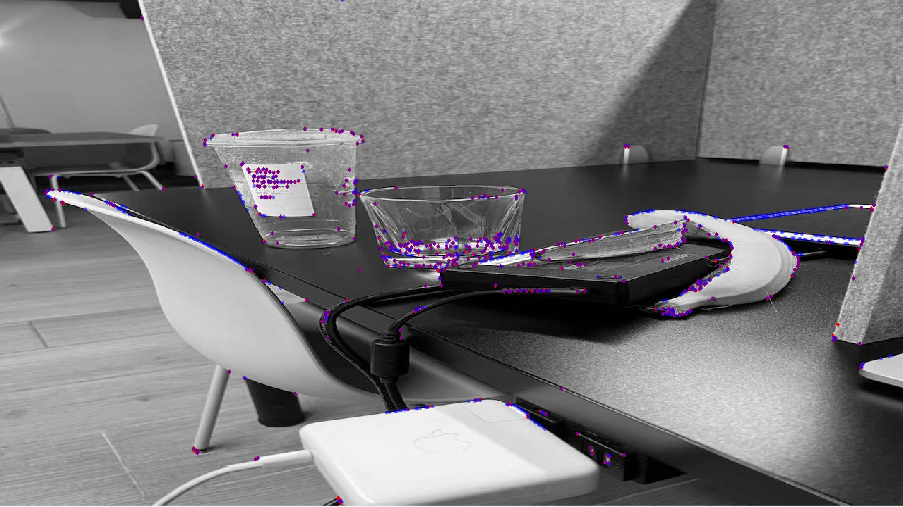

# ASIC Implementation of Local Feature Detector in ORB-SLAM3
Image feature extraction and matching is a fundamental but computation intensivetask in machine vision. This project implements FAST feature point detection and BRIEF feature descriptor construction and matching.

The function of our design include FAST feature extraction and BRIEF feature matching.

 I am responsible for all content of FAST feature extraction.

Here is the result, the red point is feature point found by software and the blue point is the feature point found by hardware.

