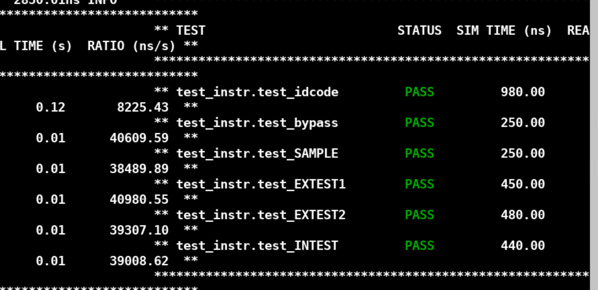
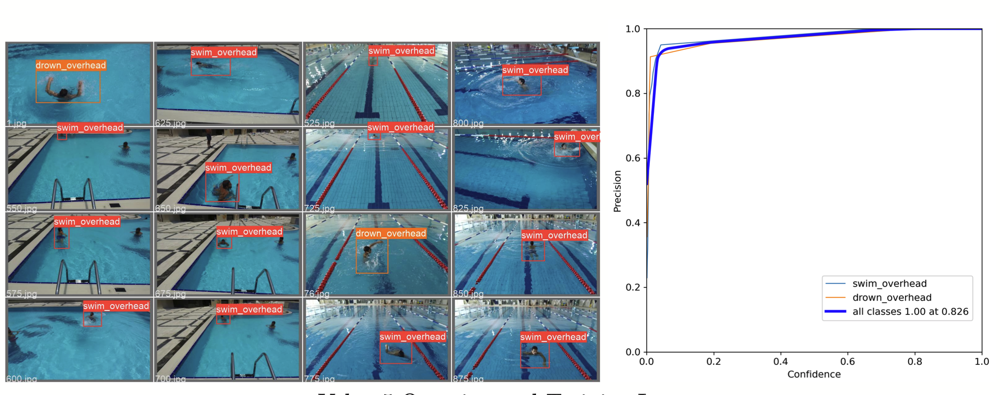

# 2022

## JTAG Interface with Boundary Scan Register

The IEEE std.1149.1 is also known as boundary scan, since it mainly consists of a scan register on the ports of a component for testing its interconnects and core logic. 

I wrote JTAG interface with Boundary Scan Register with SystemVerilog and verified using cocotb python verification framework, then create their assertions

## ASIC Implementation of Local Feature Detector in ORB-SLAM3

Image feature extraction and matching is a fundamental but computation intensivetask in machine vision. This project implements FAST feature point detection and BRIEF feature descriptor construction and matching.

The function of our design include FAST feature extraction and BRIEF feature matching.

 I am responsible for all content of FAST feature extraction.

Here is the result, the red point is feature point found by software and the blue point is the feature point found by hardware.

## Drowning Detection System Based on Yolo v5s

In 2019, an estimated 236,000 people died from drowning, making drowning a major global public health problem[1]. In the same year, drowning accounted for nearly 8% of global deaths. An efficient and responsive drowning detection system can effectively prevent the loss of life and property of swimmers. Based on a video database of swimmers in a pool, we build a deep learning-based object detection and classification system to judge whether an object in the camera is drowning.

## Course Project in Computer Architecture II

This course focus on computer architecture, and the assignment is using python to emulate hardware 

HW 2: Mystery Branch Predictor

HW3: ILP Scheduler

HW4: Mystery Caches

[back](/)