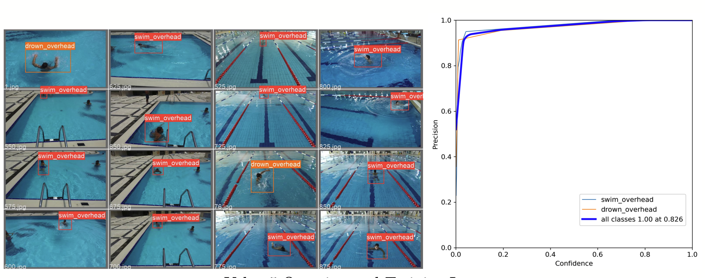

# Drowning Detection System Based on Yolo v5s

In 2019, an estimated 236,000 people died from drowning, making drowning a major global public health problem[1]. In the same year, drowning accounted for nearly 8% of global deaths. An efficient and responsive drowning detection system can effectively prevent the loss of life and property of swimmers. Based on a video database of swimmers in a pool, we build a deep learning-based object detection and classification system to judge whether an object in the camera is drowning.

